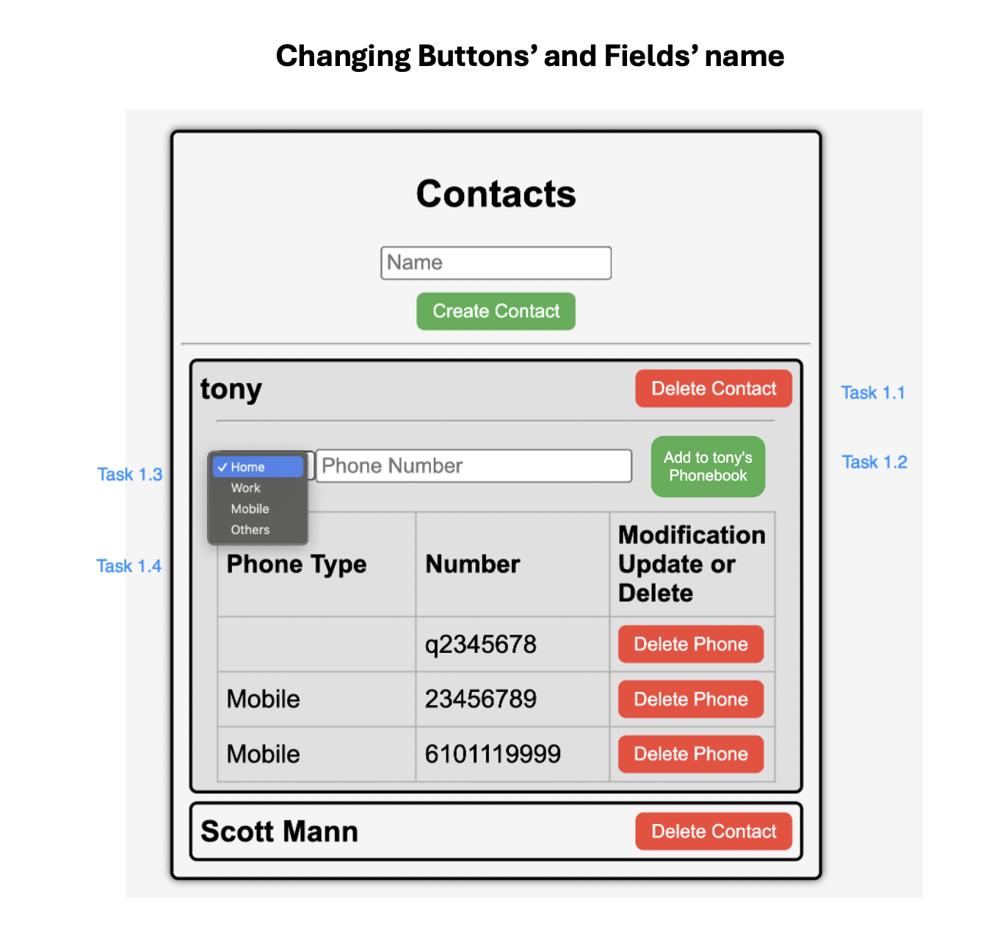
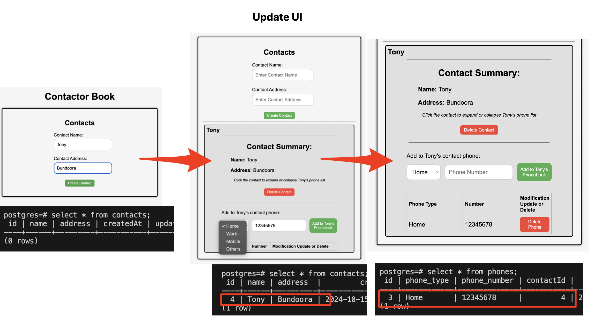
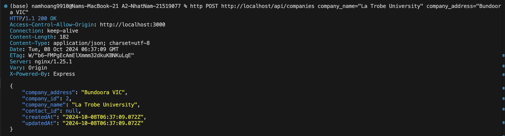
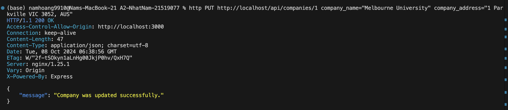

# README.md

IMPORTANT: Once you've cloned this to your forked repository, ensure that you continuously update this document as you complete each task to demonstrate your ongoing progress.

Please include your shared repository link here:

NHAT NAM HOANG (21519077)'S REPOSITORY:
https://github.com/namhoang9910/A2-NhatNam-21519077.git 

## Access Database
1 **Plsql Cheat Sheet:**
You can refer to the PostgreSQL cheat sheet [here](https://www.postgresqltutorial.com/postgresql-cheat-sheet/).

2 **Know the Container ID:**
To find out the container ID, execute the following command:
   ```bash
   docker ps
      CONTAINER ID   IMAGE                          COMMAND                  CREATED      STATUS          PORTS                NAMES
      42b57d821b3b   a2-nhatnam-21519077-nginx      "/docker-entrypoint.…"   6 days ago   Up 19 minutes   0.0.0.0:80->80/tcp   a2-nhatnam-21519077-nginx-1
      9b8fff3011e4   a2-nhatnam-21519077-frontend   "docker-entrypoint.s…"   6 days ago   Up 19 minutes   3000/tcp             a2-nhatnam-21519077-frontend-1
      5946c5c790b7   a2-nhatnam-21519077-api        "docker-entrypoint.s…"   6 days ago   Up 19 minutes   5000/tcp             a2-nhatnam-21519077-api-1
      b007ff94e66f   postgres:15.3-alpine3.18       "docker-entrypoint.s…"   6 days ago   Up 19 minutes   5432/tcp             a2-nhatnam-21519077-db-1
   ```
3. Running the application

**docker compose command:**
   ```bash
   docker compose up --build
   ```

4 **Access postgreSQL in the container:**
Once you have the container ID, you can execute the container using the following command:
You will see the example of running the PostgreSQL inside the container.
   ```bash
   docker exec -it 753bb476dca6 psql -U postgres
   namhoang9910@Nams-MacBook-21 A2-NhatNam-21519077 % docker exec -it 753bb476dca6 psql -U postgres                                       
   psql (15.3)
   Type "help" for help.
   
   postgres=# \dt
             List of relations
    Schema |   Name   | Type  |  Owner   
   --------+----------+-------+----------
    public | contacts | table | postgres
    public | phones   | table | postgres
   (2 rows)
  
    postgres=# select * from contacts;
   id |    name    |         createdAt          |         updatedAt          
   ----+------------+----------------------------+----------------------------
   1 | tony       | 2024-09-18 01:30:50.984+00 | 2024-09-18 01:30:50.984+00
   4 | Scott Mann | 2024-09-18 01:53:57.967+00 | 2024-09-18 02:01:39.607+00
    (2 rows)
    postgres=# select * from phones;
    id |  name  |   number   | contactId |         createdAt          |         updatedAt          
   ----+--------+------------+-----------+----------------------------+----------------------------
   2 | Mobile | 23456789   |         1 | 2024-09-18 01:30:58.233+00 | 2024-09-18 01:30:58.233+00
   5 | Mobile | 345678     |         4 | 2024-09-18 01:54:05.912+00 | 2024-09-18 01:54:05.912+00
   7 | Mobile | 6101119999 |         1 | 2024-09-18 02:08:46.16+00  | 2024-09-18 02:27:05.023+00
   8 | Home   | 12345      |         1 | 2024-09-24 03:49:58.702+00 | 2024-09-24 03:49:58.702+00
   9 | Home   | 1212       |         4 | 2024-09-24 03:50:05.147+00 | 2024-09-24 03:50:05.147+00

postgres=# select * from contacts;
   ```


## Task 1. 



## Task 2. API Commands
2.1. Show Contact

Command: http GET http://localhost/api/contacts

Screenshot: 

2.2. Add Contact   

Command: http POST http://localhost/api/contacts name="nam"

Screenshot: 

2.3. Delete Contact

Command: http DELETE http://localhost/api/contacts/3 

Screenshot: 

2.4. Update Contact

Command: http PUT http://localhost/api/contacts/4 name="Scott Mann"

Screenshot: 

2.5. Show Phone

Command: http GET http://localhost/api/contacts/1/phones

Screenshot: 

2.6. Add Phone

Command: http POST http://localhost/api/contacts/1/phones name="Mobile" number="01119999"

Screenshot: 

2.7. Delete Phone

Command: http DELETE  http://localhost/api/contacts/1/phones/6  

Screenshot: 

2.8. Update Phone

Command: http PUT http://localhost/api/contacts/1/phones/7 number="6101119999"

Screenshot: 

## Task 3
3.1. Modify the contacts Table

Progres command: ALTER TABLE contacts ADD COLUMN address VARCHAR(255);

postgres=# select * from contacts;

Screenshot: 


3.2. Modify the phones Table

Rename "name" to "phone_type" command: ALTER TABLE phones RENAME COLUMN name TO phone_type;

Rename "number" to "phone_number" command: ALTER TABLE phones RENAME COLUMN number TO phone_number;

postgres=# select * from phones;

Screenshot: 


3.3. Adjust the Front-End

Screenshot: 

3.4. Test API commands
3.4.1. Show Contact

Command: http GET http://localhost/api/contacts

Screenshot: 


3.4.2. Add Contact   

Command: http POST http://localhost/api/contacts name="Nam Hoang" address="1 Kingsbury Dr"

Screenshot: 

3.4.3. Delete Contact

Command: http DELETE http://localhost/api/contacts/14 

Screenshot: 

3.4.4. Update Contact

Command: http PUT http://localhost/api/contacts/13 name="Choiru Za'in" address="BUS Building 14, VIC 3086"

Screenshot: 

3.4.5. Show Phone

Command: http GET http://localhost/api/contacts/13/phones

Screenshot: 

3.4.6. Add Phone

Command: http POST http://localhost/api/contacts/13/phones phone_type="Mobile" phone_number="11121314"

Screenshot: 

3.4.7. Delete Phone

Command: http DELETE  http://localhost/api/contacts/13/phones/17  

Screenshot: 

3.4.8. Update Phone

Command: http PUT http://localhost/api/contacts/13/phones/19 phone_number="+6111121314"

Screenshot: 


## Task 4

4.1. Table creation

Command:

CREATE TABLE companies (
    company_id SERIAL PRIMARY KEY,
    company_name VARCHAR(255) NOT NULL,
    company_address VARCHAR(255),
    contact_id INT,
    CONSTRAINT fk_contact
        FOREIGN KEY (contact_id) 
        REFERENCES contacts(id)
);

Screenshot: 

4.2. API Creation

4.2.1. Show Companies

Command: http GET http://localhost/api/companies

Screenshot: 

4.2.2. Add Companies   

Command: http POST http://localhost/api/companies company_name="La Trobe University" company_address="Bundoora VIC"

Screenshot: 

4.2.3. Delete Companies

Command: http DELETE http://localhost/api/companies/2

Screenshot: 

4.2.4. Update Companies

Command: http PUT http://localhost/api/companies/1 company_name="Melbourne University" company_address="1 Parkville VIC 3052, AUS"

Screenshot: 


## Task 5

5.1. Created 3 new js files to manage the UI for companies under src/components/

- Company.js
- CompanyList.js
- NewCompany.js

5.2. Updated App.js to display companies

5.2.1. Updated delete function for Contact & Company

So that as a contact gets deleted in the contact table, its foreign key in the company table can be deleted as well.

Screenshot: 

5.2.2. Updated UI element to add contact id to company book

Only existing contact id can be added. If the contact id doesn't exist in the contact table, no record is registered. However, if the input field is left empty (per screenshot below), the company will be registered with no contact ids.

Screenshot:


5.2.3. Updated the UI to allow ADD feature of company records

Screenshot of "ADD" UI & database updates:


5.2.4. Updated the UI to allow DELETE feature of company records

Screenshot of "DELETE" UI & database updates:


5.2.5. Updated the UI to allow EDIT & UPDATE features of company records

Screenshot of "EDIT & UPDATE" UI and Database updates:


```bash

